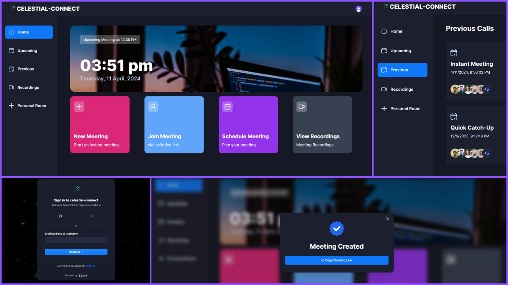

# Celestial-Connect: Real time video conferencing app using Next.js 14

This project is a Next.js 14-based real time video conferencing application designed to replicate the functionality of Zoom. Developed using TypeScript, it offers secure user authentication through Clerk and integrates with Stream for real-time video streaming capabilities. The app provides features such as creating and joining meetings, managing participants, recording meetings, and screen sharing. Users can easily schedule future meetings, access past meeting recordings, and enjoy a responsive design for seamless use across devices.

## Technologies Utilized

- **Next.js 14**
- **TypeScript**
- **Clerk**
- **Stream**
- **Tailwind CSS**
- **Schadcn**

## Deployment 

This web app is deployed on Vercel. 
